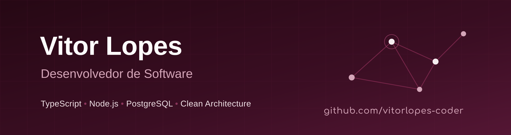

  
  
  
  
  

---

## Sobre mim

Sou desenvolvedor de software, atualmente graduando em **Análise e Desenvolvimento de Sistemas** pelo **Instituto Federal do Piauí (IFPI)**.

Tenho experiência em desenvolvimento **Backend**, com foco em construção de APIs escaláveis, seguras e orientadas a boas práticas (**Clean Architecture, DDD, SOLID**).

A nível de **Frontend**, possuo conhecimento em **React**, **Tailwind CSS** e arquitetura **MVVM** aplicando boas práticas de desenvolvimento e design responsivo.

Para além de front e backend, desenvolvo continuamente minhas habilidades com programação assistida por IA, aprimorando e refinando o uso de habilidades (Skills) e procurando sempre otimizar o ambiente de desenvolvimento (Harness) para seu propósito buscando sempre otimizar o custo de desenvolvimento e qualidade da entrega.

Sou entusiasta de **Linux** e automação de ambientes com **Docker**, sempre buscando otimizações de queries, modelagem eficiente de bancos relacionais e código sustentável.

* Graduando em **Análise e Desenvolvimento de Sistemas** pelo **Instituto Federal do Piauí (IFPI)**.
* Focado em desenvolvimento **Back-end**, projetando e construindo APIs escaláveis, seguras e orientadas a boas práticas (**Clean Architecture, DDD, SOLID**).
* Usuário entusiasta de **Linux** e automação de ambientes com **Docker**.
* Sempre em busca de otimizações de queries, modelagem eficiente de bancos relacionais e código sustentável.

---

## Tech Stack

### Linguagens

  

### Back-end & Banco de Dados

  
  

### Stacks de interesse

  

 

---

## Estatísticas

  
  

 

  

---

## Troféus

  

## Vamos conversar?

&nbsp;

&nbsp;

  

*Obrigado pela visita! Se curtiu algum projeto meu, não esqueça de deixar uma estrela!*

